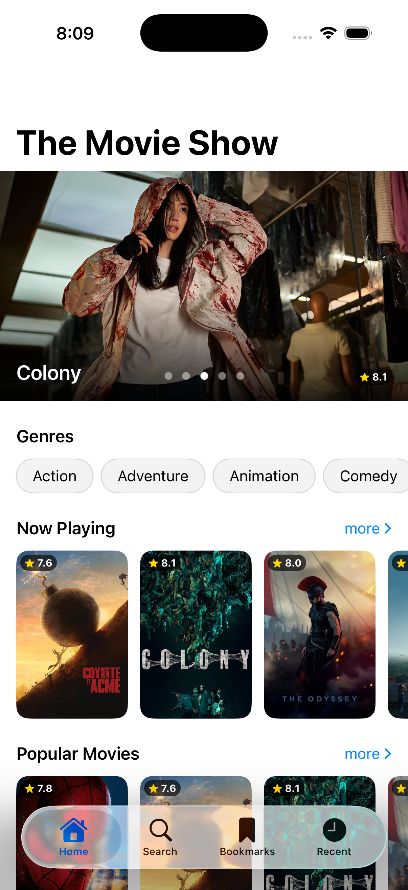
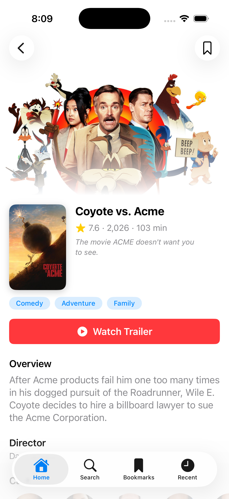
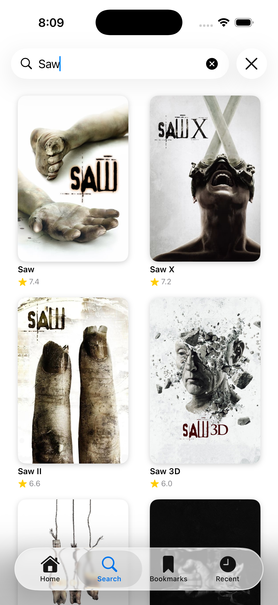
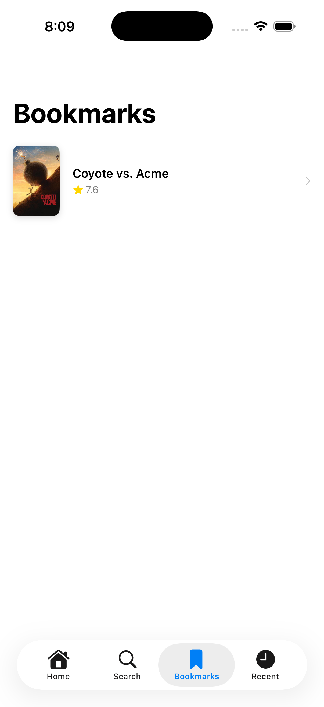
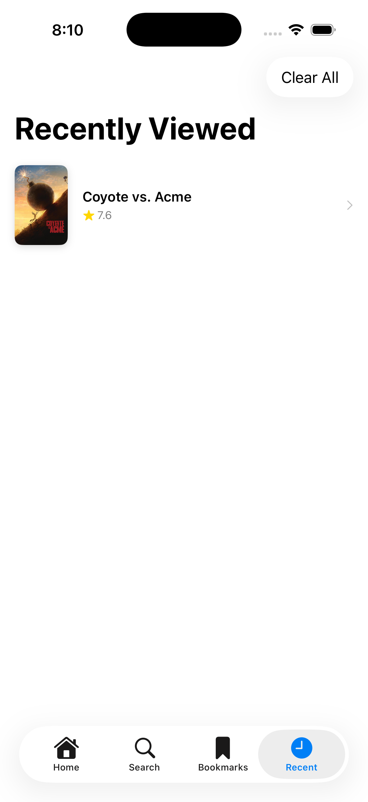
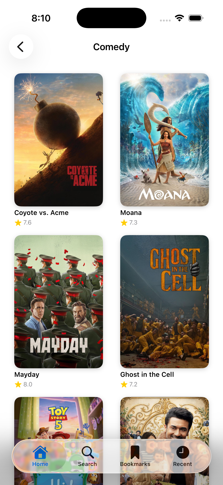

# The Movie Show

A full-featured iOS movie browser app built with SwiftUI and TMDB API, following **MVVM-C (Model-View-ViewModel-Coordinator)** architecture across 9 development phases.

---

## Screenshots

| Home | Movie Detail | Search |
|------|-------------|--------|
|  |  |  |

| Bookmarks | Recently Viewed | Genre / Category List |
|-----------|----------------|----------------------|
|  |  |  |

---

## Features

- **Home screen** — Auto-advancing featured banner (paging carousel), genre chips that open filtered lists, horizontal sections (Now Playing, Popular, Top Rated) with "more" navigation
- **Movie Detail** — Backdrop hero image, cast scroll, trailer link, similar movies, bookmark toggle with haptic feedback
- **Search** — 350 ms debounced search, stale-result guard, infinite scroll
- **Genre browsing** — Tapping any genre chip opens a full paginated list via TMDB's `/discover/movie` endpoint
- **Bookmarks** — SwiftData-persisted, swipe-to-delete, optimistic removal
- **Recently Viewed** — Auto-recorded on every detail view, clear-all with confirmation alert
- **Offline support** — Network-first with SwiftData cache fallback; orange offline banner via `NWPathMonitor`
- **Background refresh** — Home data auto-refreshes when app returns to foreground if last load was > 30 min ago
- **Shimmer loading** — Animated skeleton placeholders on all images
- **Pull-to-refresh** — On Home, category lists, Bookmarks, and Recently Viewed
- **Accessibility** — Labels on movie cards, bookmark button, section "more" buttons; empty state icon pulse animation

---

## Architecture

```
App/
├── AppCoordinator          # Tab selection, owns all feature coordinators
├── DependencyContainer     # Composition root — wires all concrete types
└── RootView                # TabView + offline banner

Packages/
├── Core/
│   ├── Common/             # Domain models, ViewState, AppError, CoordinatorProtocol
│   ├── Data/               # Repository protocols + SwiftData implementations
│   ├── DesignSystem/       # Colors, Spacing, Typography, reusable components
│   ├── Networking/         # NetworkService, TMDBEndpoint, DTOs, mapping
│   └── Persistence/        # SwiftData entities (CachedMovie, Bookmark, RecentlyViewed)
└── Features/
    ├── Home/               # HomeViewModel, HomeView, MovieListViewModel, MovieListView
    ├── MovieDetail/        # MovieDetailViewModel, MovieDetailView
    ├── Search/             # SearchViewModel, SearchView
    ├── Bookmarks/          # BookmarksViewModel, BookmarksView
    └── RecentlyViewed/     # RecentlyViewedViewModel, RecentlyViewedView
```

### Key patterns

| Pattern | Implementation |
|---------|---------------|
| **MVVM-C** | `@Observable @MainActor` ViewModels; Coordinator protocols own navigation via `NavigationPath` |
| **Protocol-first DI** | Every dependency injected through a protocol; no singletons or service locators |
| **Repository pattern** | `MovieRepositoryProtocol`, `BookmarkRepositoryProtocol`, `RecentlyViewedRepositoryProtocol` — views never touch SwiftData or network directly |
| **ViewState enum** | `.idle / .loading / .loaded(T) / .empty / .failed(AppError)` drives every screen |
| **Coordinator hierarchy** | `CoordinatorProtocol` → `MovieDetailCoordinatorProtocol` → feature protocols; conforming to a feature protocol automatically satisfies all parent requirements |
| **Cache strategy** | Network-first on page 1 (replaces stale cache); cache fallback on `networkUnavailable`; page 2+ appends without clearing |

---

## Tech Stack

| Layer | Technology |
|-------|-----------|
| UI | SwiftUI (iOS 17+) |
| State | `@Observable` macro (Observation framework) |
| Navigation | `NavigationStack` + `NavigationPath` |
| Persistence | SwiftData (`@Model`) |
| Networking | `URLSession` async/await |
| Connectivity | `Network.framework` (`NWPathMonitor`) |
| Concurrency | Swift Structured Concurrency (`async let`, `Task`, `Task.sleep`) |
| Testing | Swift Testing framework + XCTest |
| API | TMDB v3 REST API |

---

## Setup

### 1. Clone the repo

```bash
git clone <repo-url>
cd "The Movie Show"
open "The Movie Show.xcodeproj"
```

### 2. Get a TMDB API key

1. Create a free account at [themoviedb.org](https://www.themoviedb.org)
2. Go to **Settings → API** and copy your **Read Access Token (v4 auth)**

### 3. Set the token

**Option A — Environment variable (recommended, never committed to source control):**

In Xcode → Product → Scheme → Edit Scheme → Run → Arguments → Environment Variables, add:

```
TMDB_ACCESS_TOKEN = <your_read_access_token>
```

**Option B — Info.plist:**

Add a key `TMDB_ACCESS_TOKEN` with your token value to `Info.plist`.

### 4. Build and run

Select the **iPhone 17 Pro** simulator (or any iOS 17+ device) and press **⌘R**.

---

## Project Structure

```
The Movie Show/
├── App/
│   ├── AppCoordinator.swift
│   ├── DependencyContainer.swift
│   └── RootView.swift
├── Packages/
│   ├── Core/
│   │   ├── Common/
│   │   │   ├── Extensions/
│   │   │   ├── Models/          # Movie, MovieDetail, Genre, CastMember, Video
│   │   │   ├── AppError.swift
│   │   │   ├── CoordinatorProtocol.swift
│   │   │   └── ViewState.swift
│   │   ├── Data/
│   │   │   ├── Mocks/           # PreviewRepositories for SwiftUI previews
│   │   │   ├── Repositories/    # MovieRepository, BookmarkRepository, RecentlyViewedRepository
│   │   │   └── RepositoryProtocols/
│   │   ├── DesignSystem/
│   │   │   ├── Components/      # AsyncImageView (shimmer), MovieCardView, EmptyStateView, ErrorView, LoadingView
│   │   │   ├── Colors.swift
│   │   │   ├── Spacing.swift
│   │   │   └── Typography.swift
│   │   ├── Networking/
│   │   │   ├── DTOs/
│   │   │   ├── Mapping/
│   │   │   ├── NetworkMonitor.swift
│   │   │   ├── NetworkService.swift
│   │   │   └── TMDBEndpoint.swift
│   │   └── Persistence/
│   │       ├── Entities/        # CachedMovieEntity, BookmarkEntity, RecentlyViewedEntity
│   │       └── PersistenceContainer.swift
│   └── Features/
│       ├── Home/
│       │   ├── HomeCoordinator.swift
│       │   ├── HomeView.swift
│       │   ├── HomeViewModel.swift
│       │   ├── MovieListView.swift
│       │   └── MovieListViewModel.swift
│       ├── MovieDetail/
│       │   ├── MovieDetailView.swift
│       │   └── MovieDetailViewModel.swift
│       ├── Search/
│       │   ├── SearchCoordinator.swift
│       │   ├── SearchView.swift
│       │   └── SearchViewModel.swift
│       ├── Bookmarks/
│       │   ├── BookmarksCoordinator.swift
│       │   ├── BookmarksView.swift
│       │   └── BookmarksViewModel.swift
│       └── RecentlyViewed/
│           ├── RecentlyViewedCoordinator.swift
│           ├── RecentlyViewedView.swift
│           └── RecentlyViewedViewModel.swift
├── TheMovieShowApp.swift
└── Assets.xcassets

The Movie ShowTests/
├── Networking/
│   ├── MockURLProtocol.swift
│   ├── MovieMappingTests.swift
│   └── NetworkServiceTests.swift
└── Repositories/
    ├── BookmarkRepositoryTests.swift
    ├── MovieFixtures.swift
    └── RecentlyViewedRepositoryTests.swift
```

---

## TMDB Endpoints Used

| Feature | Endpoint |
|---------|---------|
| Now Playing | `GET /movie/now_playing` |
| Popular | `GET /movie/popular` |
| Top Rated | `GET /movie/top_rated` |
| Upcoming | `GET /movie/upcoming` |
| Movie Detail | `GET /movie/{id}` |
| Credits | `GET /movie/{id}/credits` |
| Videos | `GET /movie/{id}/videos` |
| Similar | `GET /movie/{id}/similar` |
| Search | `GET /search/movie` |
| Discover by Genre | `GET /discover/movie?with_genres={id}` |
| Genres | `GET /genre/movie/list` |

---

## Development Phases

| Phase | Description |
|-------|-------------|
| 0 | Xcode project setup, folder structure |
| 1 | Networking layer — `NetworkService`, TMDB endpoints, DTOs |
| 2 | Data layer — SwiftData entities, repository implementations, unit tests |
| 3 | App shell — MVVM-C skeleton, DI wiring, tab bar |
| 4 | Home screen — featured banner carousel, genre chips, horizontal sections |
| 5 | Movie Detail — backdrop, cast, trailer, similar movies, bookmark |
| 6 | Search — debounced search, pagination, stale-result guard |
| 7 | Bookmarks & Recently Viewed — persisted lists, swipe-to-delete, clear history |
| 8 | Offline support — `NetworkMonitor`, offline banner, cache TTL, foreground refresh |
| 9 | Polish — shimmer animations, pull-to-refresh, haptic feedback, accessibility |

---

## Running Tests

```bash
# Unit tests
⌘U in Xcode

# Or via command line
xcodebuild test \
  -scheme "The Movie Show" \
  -destination "platform=iOS Simulator,name=iPhone 17 Pro"
```

Tests cover network mapping, repository CRUD operations (using in-memory SwiftData), and URL construction.

---

## License

This project is for portfolio and educational purposes. Movie data provided by [The Movie Database (TMDB)](https://www.themoviedb.org). This product uses the TMDB API but is not endorsed or certified by TMDB.
